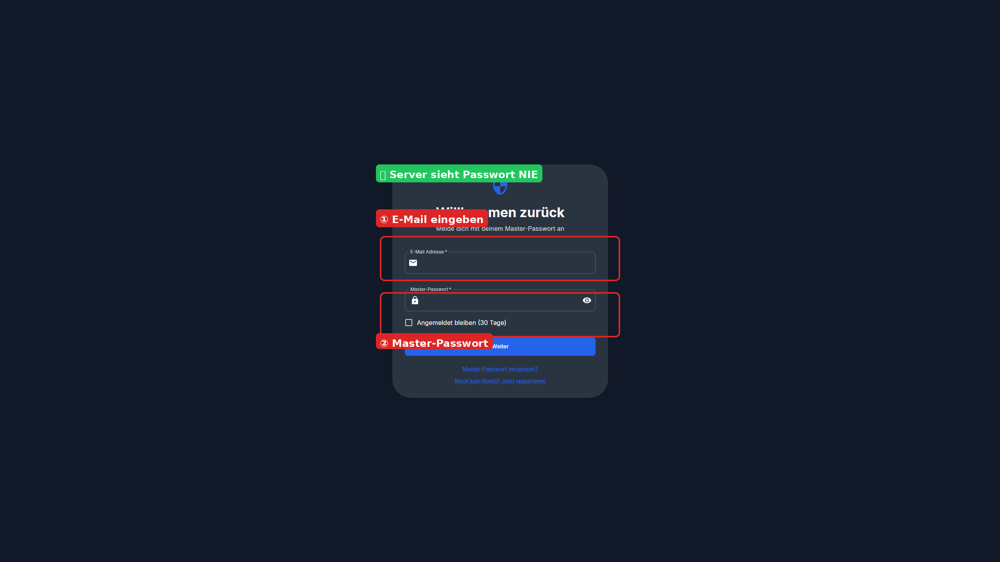
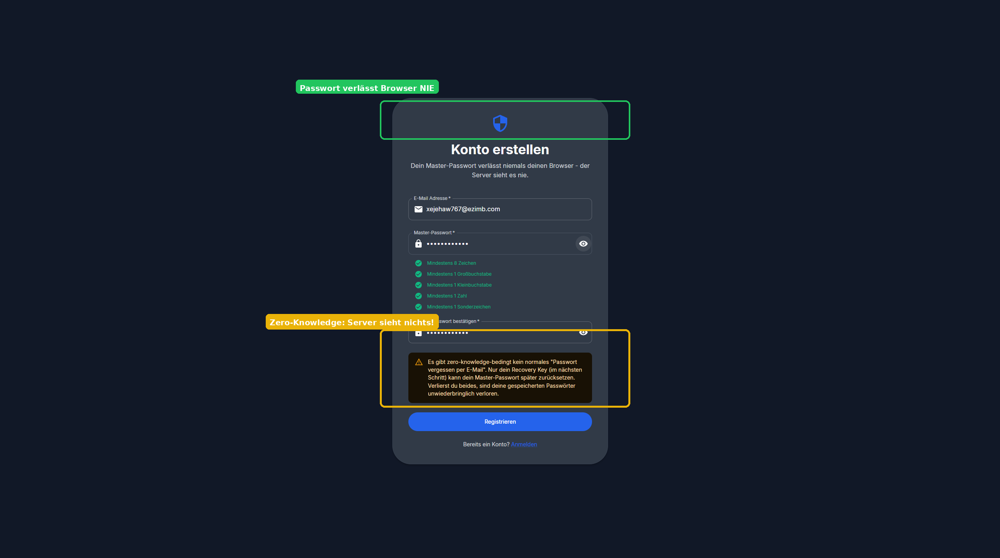
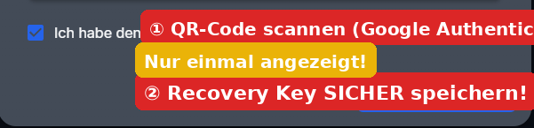
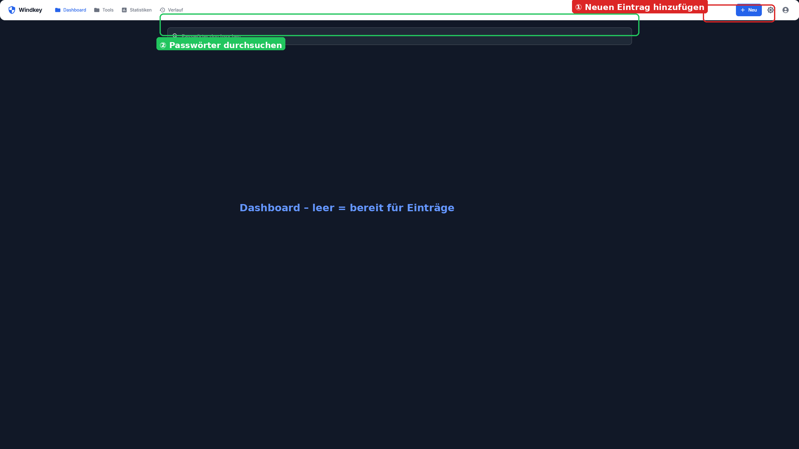
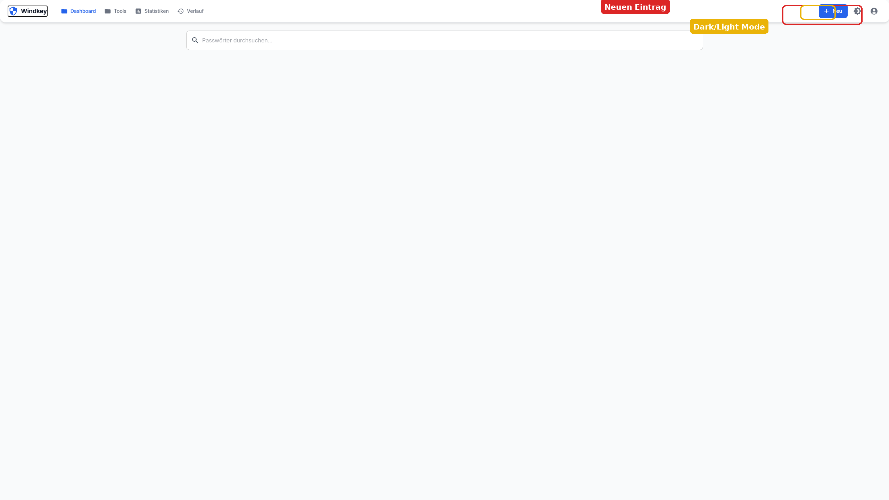
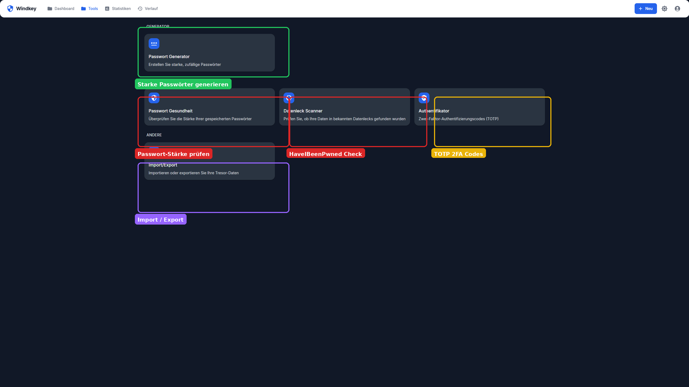
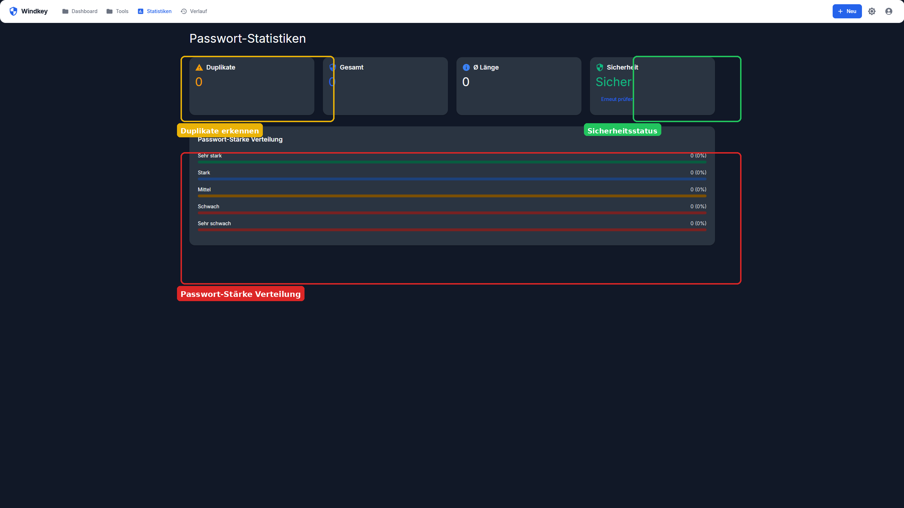

# Winkey — Zero-Knowledge Password Manager

A self-hosted, zero-knowledge password manager for your home network. Built with **Flask**, **React** (Material UI), and a **Chrome extension**. Your master password and vault data never leave your browser unencrypted — the server only ever stores opaque ciphertext.

> **Originally created by [Hood Informatik](https://github.com/hoodinformatik)** ([Windkey](https://github.com/hoodinformatik/Windkey)) — continued and finished by [MilcioSSQ](https://github.com/MilcioSSQ).

---
  
## Screenshots

> Add your own screenshots to a `screenshots/` folder in this repo with the filenames below before publishing — this section expects them to exist and will show broken images otherwise.

<details open>
<summary><b>Login & Registration</b></summary>

| Login | Register | Recovery |
| --- | --- | --- |
|  |  |  |

</details>

<details open>
<summary><b>Dashboard</b></summary>

| Dark Mode | Light Mode |
| --- | --- |
|  |  |

</details>

<details open>
<summary><b>Tools & Statistics</b></summary>

| Tools | Statistics |
| --- | --- |
|  |  |

</details>

---

## Features

- **Zero-knowledge encryption** — Argon2id key derivation + AES-256-GCM, entirely client-side. The server never sees your master password or decrypted vault.
- **2FA (TOTP)** — Every account requires Google Authenticator (or compatible). QR code setup built in.
- **Password generator** — Configurable length, character sets, and rules.
- **Password health check** — Strength analysis for all stored passwords at a glance.
- **Breach scanner** — Checks your passwords against HaveIBeenPwned using k-anonymity (never sends your actual password anywhere). Checking an email address for known breaches is also supported, but needs your own HIBP API key — see [Configure the backend](#2-configure-the-backend) below.
- **Duplicate detection** — Flags reused passwords across entries.
- **Categories** — Organize passwords into custom groups.
- **Activity history** — Logs every vault action with timestamps and IP.
- **Recovery key** — One-time key generated at registration. The only way to change your master password without losing data. No "forgot password" email reset — by design.
- **Import / Export** — Move your data in and out.
- **Chrome extension** — Autofill credentials in the browser, connected to your self-hosted server.
- **Dark / Light mode** — Full theme support.
- **Responsive UI** — Works on desktop, tablet, and mobile.
- **LAN-only** — The backend rejects any request from outside your local network.

---

## Security

| Layer | What it does |
| --- | --- |
| **Argon2id** | Derives your vault key from your master password in the browser (memory-hard, anti-brute-force). |
| **AES-256-GCM** | Encrypts every vault entry client-side before it hits the server. |
| **CSRF protection** | Flask-WTF synchronizer tokens on all state-changing requests. |
| **Rate limiting** | Flask-Limiter on login, register, and recovery endpoints. |
| **Account lockout** | 10 failed login attempts → 15 min lockout. |
| **HTTPS** | Self-signed dev certificate for WebCrypto API access on LAN IPs. |
| **Enumeration protection** | Pre-login responses are deterministic per email — no user-exists oracle. |

---

## Tech Stack

**Backend:** Python 3.11+, Flask, SQLAlchemy (SQLite), Flask-Login, Flask-Limiter, PyOTP, bcrypt

**Frontend:** React, Material UI, Axios, react-router-dom

**Crypto:** Argon2id + AES-256-GCM + HKDF (via noble-hashes, runs entirely client-side)

**Chrome Extension:** Manifest V3, content scripts + popup + options page

---

## Project Structure

```
winkey/
├── backend/
│   ├── app.py                  # Flask app, DB models, LAN-only middleware
│   ├── routes.py               # API endpoints (auth, vault, recovery, history, breach-check)
│   ├── mail.py                 # Verification & recovery emails
│   └── generate_dev_cert.py    # Self-signed HTTPS cert generator
├── frontend/
│   └── src/
│       ├── components/
│       │   ├── Dashboard.js    # Main vault view (add/edit/delete/search)
│       │   ├── Login.js        # Login + 2FA
│       │   ├── Register.js     # Registration + TOTP setup
│       │   ├── Recovery.js     # Master password recovery via recovery key
│       │   ├── Stats.js        # Password health, duplicates, breach check
│       │   ├── Tools.js        # Generator, health check, breach scanner, import/export
│       │   ├── PasswordGeneratorTool.js / Authenticator.js / ImportExport.js / BreachScanner.js
│       │   ├── History.js      # Activity log
│       │   ├── Layout.js       # App shell / navigation
│       │   ├── Unlock.js       # Session unlock
│       │   └── VerifyEmail.js  # Email verification flow
│       ├── contexts/
│       │   ├── AuthContext.js   # Auth state, session, vault key
│       │   └── ThemeContext.js  # Dark/light mode
│       └── crypto/
│           └── windkeyCrypto.js # Argon2id + AES-GCM + HKDF — the crypto core
├── chrome-extension/           # MV3 extension with autofill
│   ├── manifest.json
│   ├── popup.html / popup.js
│   ├── options.html / options.js
│   ├── content.js / content.css
│   ├── background.js
│   └── vendor/                 # Bundled noble-hashes for offline crypto
└── requirements.txt
```

---

## Installation

### Prerequisites

- Python 3.11+
- Node.js 18+ and npm
- A Gmail account with an [App Password](https://myaccount.google.com/apppasswords) (optional — without it, verification emails are printed to the console)
- Optional: a [HaveIBeenPwned API key](https://haveibeenpwned.com/api/key) (paid, ~3.50 USD/month) if you want the email breach-check to work — the password breach-check is free and works without it

### 1. Generate HTTPS certificate

```bash
cd backend
pip install -r ../requirements.txt
python generate_dev_cert.py
```

### 2. Configure the backend

Edit `backend/.env`:

```env
SECRET_KEY=                      # leave blank to auto-generate on first run
MAIL_USERNAME=your-email@gmail.com
MAIL_PASSWORD=your-app-specific-password
FRONTEND_URL=https://<your-lan-ip>:3000
ADMIN_EMAIL=your-email@example.com     # the only address that can register without an invite code
HIBP_API_KEY=                          # optional - only needed for the email breach-check in Tools > Datenleck Scanner
```

Without `HIBP_API_KEY`, the breach scanner's password check still works fully (it's free and never needs a key) — only the email check will show a "not configured" message until you add one.

### 3. Start the backend

```bash
cd backend
python app.py
```

Runs on `https://0.0.0.0:5000`.

### 4. Start the frontend

```bash
cd frontend
npm install
npm start
```

Opens at `https://localhost:3000`. Accept the self-signed certificate warning on first visit — expected and safe.

### 5. Chrome extension (optional)

1. `chrome://extensions/` → enable **Developer mode**
2. **Load unpacked** → select the `chrome-extension` folder
3. Open the extension options and set your server address

---

## Known Limitations

- **Recovery key lost + master password forgotten = permanent data loss.** This is inherent to zero-knowledge encryption, not a bug.
- **Master password rules are client-side only** — the server never sees the raw password.
- **Screenshot prevention is best-effort** — revealed passwords auto-hide on tab blur, but OS-level screenshots cannot be blocked.
- This is a hardened personal project, not an audited enterprise product.

---

## Credits

Originally created by **[Hood Informatik](https://github.com/hoodinformatik)** as [Windkey](https://github.com/hoodinformatik/Windkey). The initial version was built live on stream — I ([MilcioSSQ](https://github.com/MilcioSSQ)) picked it up, finished the remaining features, and maintain this version.

---

## License

MIT — see [LICENSE](LICENSE).
